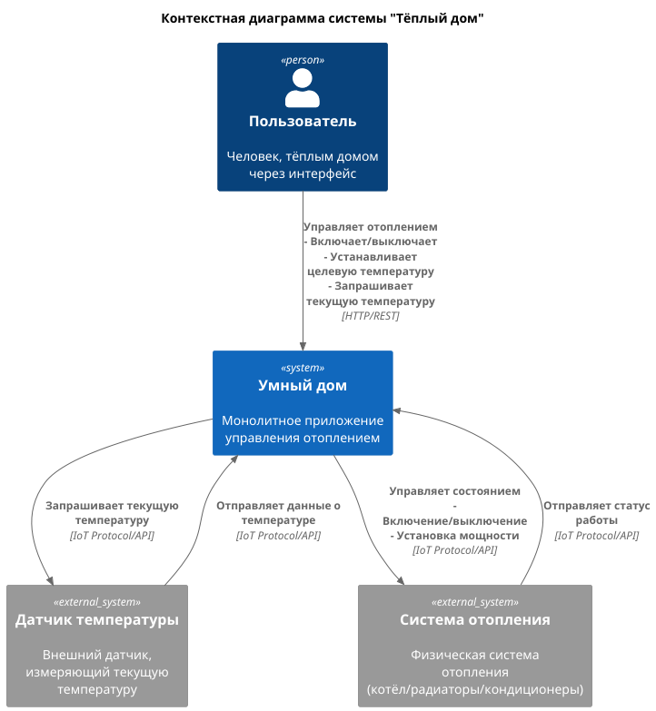
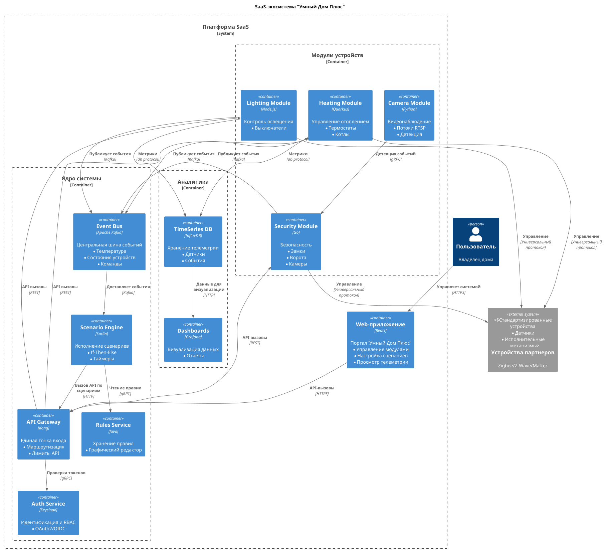
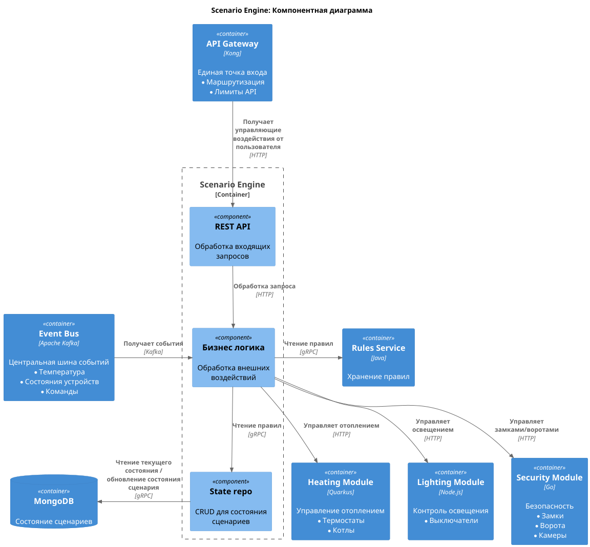
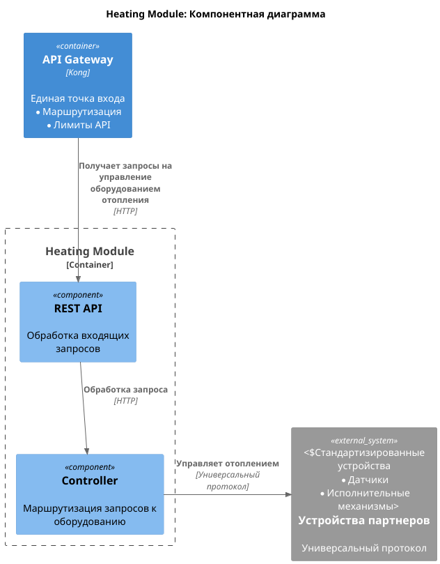
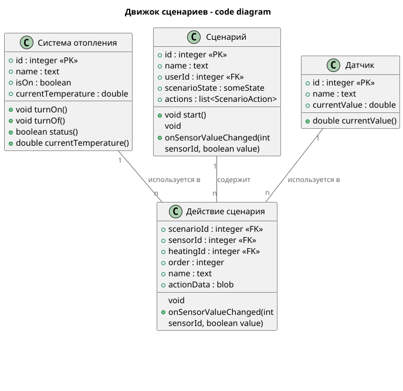
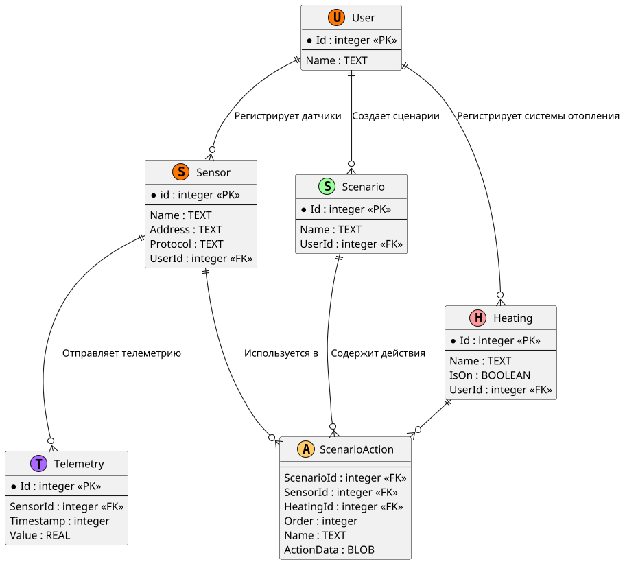

# Домашка спринта "Создание микросервисов, построение пайплайна CI/CD"

# Задание 1. Анализ и планирование

### 1. Описание функциональности монолитного приложения

**Управление отоплением:**

- Пользователи могут включать/выключать конкретную систему отопления
- Пользователи могут получать текущий статус конкретной системы отопления (вкл/выкл)
- Пользователи могут получать/устанавливать желаемую температуру для системы отопления
- Система поддерживает множество систем отопления

**Мониторинг температуры:**

- Пользователи могут получать температуру, используемую системой отопления в качестве референсной

### 2. Анализ архитектуры монолитного приложения

Архитектура приложения представляет собой монолит на Java с СУБД Postgres. Всё синхронно. Никаких асинхронных вызовов, микросервисов и реактивного взаимодействия в системе нет. Всё управление идёт от сервера к датчику. Данные о температуре также получаются через запрос от сервера к датчику.

### 3. Определение доменов и границы контекстов

Опишите здесь домены, которые вы выделили.

- Домен управления отопительными системами
- Домен мониторинга температуры
 
### **4. Проблемы монолитного решения**

В контексте решения текущих, а не новых задач, проблем у монолитного решения нет, так как область решаемых задач довольно небольшая, и использование микросервисов только добавит ненужной сложности.

### 5. Визуализация контекста системы — диаграмма С4

# Задание 2. Проектирование микросервисной архитектуры

При проектировании микросервисой архитектуры я решил выделить следующие микросервисы:

1. **Lighting** - микросервис, отвечающий за управление освещением
2. **Heating** - микросервис, отвечающий за управление отоплением
3. **Camera** - микросервис, отвечающий за видеонаблюдение и тревожные сигналы с камер
4. **Security** - микросервис, отвечающий за управление замками, воротами, и транслировании тревожных сигналов с камер в шину данных
5. **Scenario engine** - микросервис, отвечающий за исполнение сценариев. При получении события из шины данных прогоняет их через пользовательские сцерании, при необходимости посылает управляющие воздействия в модули **Lighting**, **Heating** и **Security**.
6. **Rules service** - микросервис, релизующий хранение и редактирование пользовательских сценариев
7. **API Gateway** - единая точка входа, маршрутизация, авторизация
8. **Auth service** - Аутентификация и авторизация
9. **Timeseries DB** - база данных для хранения телеметрии
10. **Event Bus (kafka)** - Шина данных

**Диаграмма контейнеров (Containers)**

**Диаграмма компонентов (Components)**

### Диаграмма компонентов движка сценариев

### Диаграмма компонентов модуля отопления

**Диаграмма кода (Code)**

### Диаграмма кода движка сценариев

# Задание 3. Разработка ER-диаграммы

#  ❌ Задание 4. Создание и документирование API

### 1. Тип API

Укажите, какой тип API вы будете использовать для взаимодействия микросервисов. Объясните своё решение.

### 2. Документация API

Здесь приложите ссылки на документацию API для микросервисов, которые вы спроектировали в первой части проектной работы. Для документирования используйте Swagger/OpenAPI или AsyncAPI.